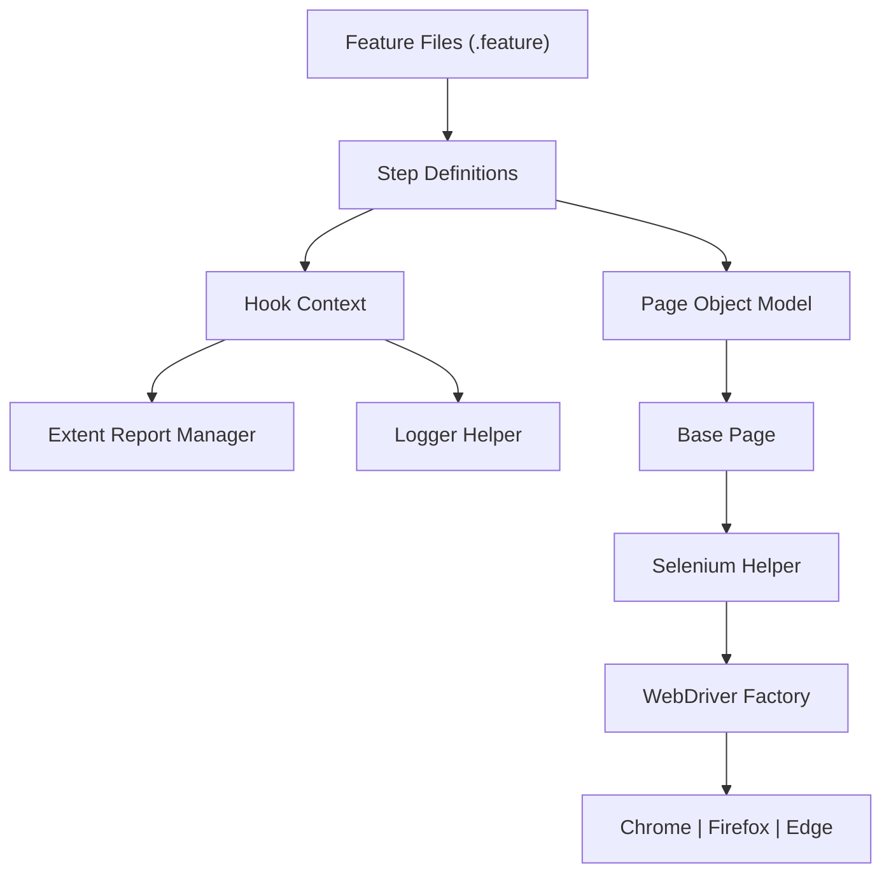
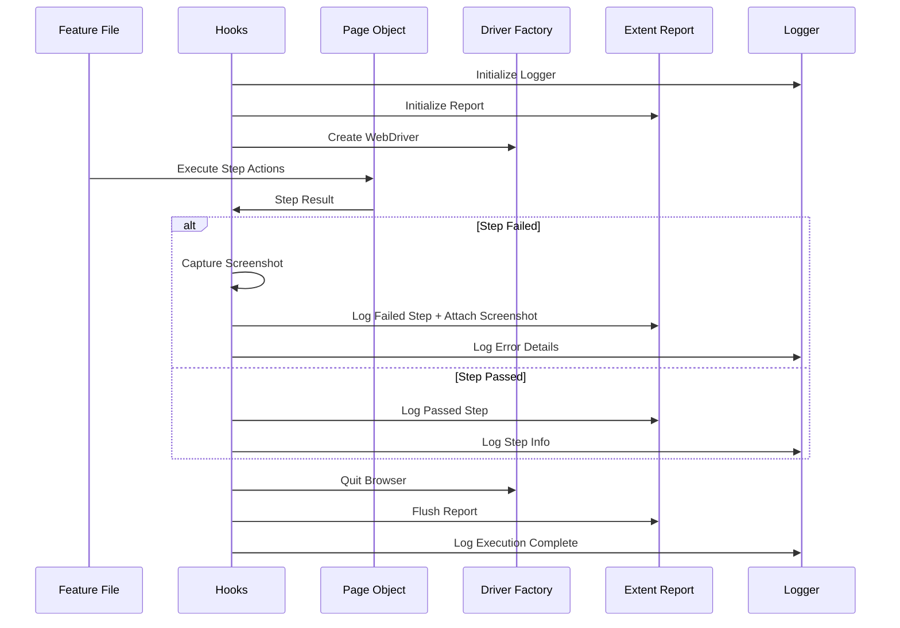
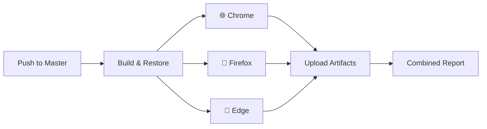
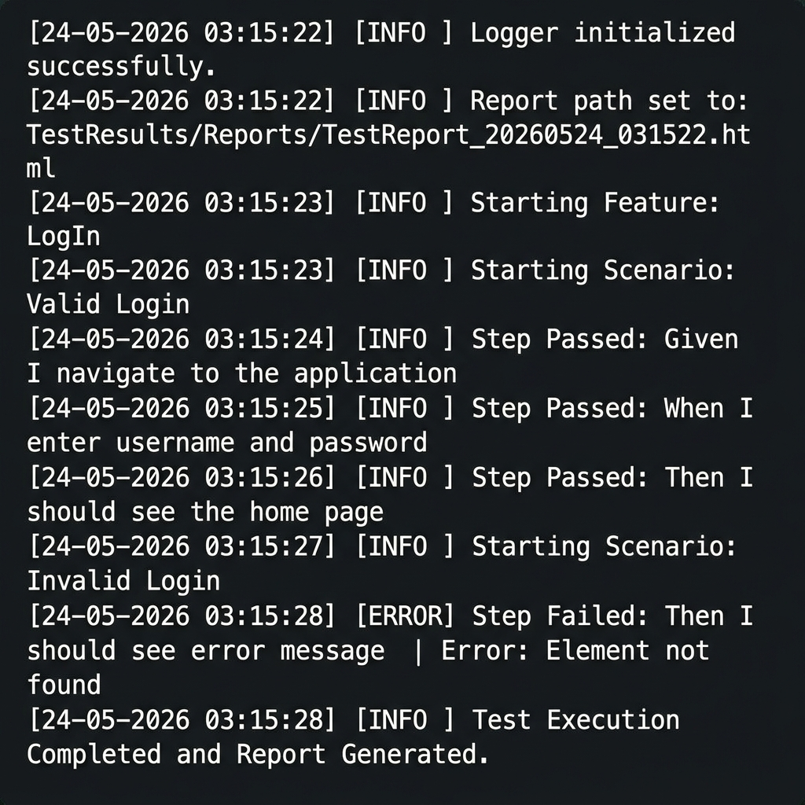

# 🚀 ReqnRoll Enterprise Automation Framework

An enterprise-grade, highly scalable, and thread-safe **Selenium BDD** framework built using **.NET 8** and **ReqnRoll** (the modern successor to SpecFlow). Includes CI/CD integration with **GitHub Actions** for cross-browser parallel execution.

---

## 🏗️ Framework Architecture

This framework follows a strict **3-Layer Architecture** to ensure clean separation of concerns, high maintainability, and easy scalability.

### 1. Test Layer (BDD)

- **Features** — Gherkin-based `.feature` files describing business behaviors.
- **Step Definitions** — C# classes that map Gherkin steps to code logic.
- **Hooks** — Global lifecycle management (Before/After scenarios, reporting, logging).

### 2. Page Object Model (POM) Layer

- **Pages** — Encapsulates web elements and business actions for specific application pages.
- **BasePage** — Provides a shared driver instance and helper methods to all page objects.

### 3. Core Support Layer

- **Drivers** — Factory pattern for cross-browser driver management (Chrome, Firefox, Edge).
- **Helpers** — Common Selenium utilities (waits, clicks, scrolls, screenshots).
- **Support** — Strongly-typed configuration, Extent Report manager, and log4net logger.

---

## 🖼️ Framework Visualization

### High-Level Architecture



### Execution Workflow



---

## 🔄 CI/CD Pipeline (GitHub Actions)

The framework includes a production-ready GitHub Actions pipeline that runs tests across **3 browsers in parallel**.

### Pipeline Architecture



### Pipeline Features

- **Matrix Strategy** — Runs Chrome, Firefox, and Edge in parallel jobs.
- **Headless Mode** — Automatically enabled via `HEADLESS=true` environment variable.
- **Browser Setup** — Uses `browser-actions/setup-chrome`, `setup-firefox`, and `setup-edge` actions.
- **NuGet Caching** — Speeds up builds by caching restored packages.
- **Test Summary** — Parses TRX files and displays pass/fail counts in the GitHub Actions summary.
- **Combined Report** — Merges results from all browsers into a single HTML report using ReportGenerator.

---

## 📊 Reporting Dashboard (Extent Portal)

The framework generates a rich, interactive reporting portal that provides:

1. **🔍 Step-by-Step Traceability** — Full visibility into every Gherkin step executed.
2. **📸 Visual Evidence** — Automatic screenshots attached to failed steps.
3. **📈 Execution Metrics** — Dashboard views showing pass/fail percentages and execution time.
4. **🧵 Thread Isolation** — Cleanly separated reports even when running tests in parallel.

### Report Preview


> [!TIP]
> This framework is designed to be easily integrated with **ReportPortal.io** or **Allure Reports** for centralized enterprise-level test management.

---

## ✨ Key Features

- **🌐 Cross-Browser Support** — Chrome, Firefox, and Edge via `AppConfig.json` or `BROWSER` env var.
- **📊 Extent Reports** — Interactive HTML reports with screenshot capture on failure.
- **📜 log4net Logging** — Cross-platform console and file logging with timestamped log files.
- **🧵 Thread-Safe Execution** — `ThreadLocal` storage for parallel test reporting.
- **⚙️ Strongly-Typed Config** — Configuration mapped to C# classes (`ConfigSettings.cs`) for type safety.
- **💉 Dependency Injection** — Uses `BoDi` (built-in to ReqnRoll) for clean object management.
- **🔄 CI/CD Ready** — GitHub Actions workflow with matrix strategy and combined reporting.
- **🖥️ Headless Mode** — Configurable via `AppConfig.json` or `HEADLESS` env var for CI environments.

---

## 📂 Project Structure

```text
ReqnRollProjectArchitecture/
├── .github/workflows/       # GitHub Actions CI/CD pipeline
├── Credentials/             # AppConfig.json, Log4Net.config
│   ├── AppConfig.json       # Test settings, browser config, credentials
│   ├── CredentialsManager.cs # Strongly-typed config reader
│   └── Log4Net.config       # Cross-platform logging configuration
├── Drivers/                 # WebDriver Factory pattern
│   ├── IDriverFactory.cs    # Driver factory interface
│   ├── ChromeDriverFactory.cs
│   ├── FirefoxDriverFactory.cs
│   ├── EdgeDriverFactory.cs
│   └── WebDriverFactory.cs  # Factory resolver
├── Features/                # BDD Feature files (.feature)
├── Helpers/                 # Selenium wrapper utilities
│   └── SeleniumHelper.cs    # Waits, clicks, screenshots, etc.
├── Hook/                    # ReqnRoll lifecycle hooks
│   └── Hook.cs              # Reporting, logging, screenshot on failure
├── Pages/                   # Page Object Model classes
│   ├── BasePage.cs          # Abstract base page
│   ├── LogInPage.cs
│   └── LogOutPage.cs
├── StepDefinitions/         # Scenario step implementations
├── Support/                 # Framework support classes
│   ├── ConfigSettings.cs    # Strongly-typed config model
│   ├── ExtentReportManager.cs # Thread-safe Extent Reports
│   └── LoggerHelper.cs      # log4net wrapper
└── TestResults/             # Generated at runtime
    ├── Reports/             # HTML Extent Reports
    ├── Logs/                # Timestamped log files
    └── Screenshots/         # Failure screenshots
```

---

## 🚀 Getting Started

### Prerequisites

- [.NET 8 SDK](https://dotnet.microsoft.com/download/dotnet/8.0)
- IDE: Visual Studio 2022 or VS Code
- Browser: Chrome, Firefox, or Edge installed locally

### Configuration

Update `Credentials/AppConfig.json` with your environment details:

```json
{
  "TestSettings": {
    "BaseUrl": "https://www.saucedemo.com/",
    "Browsers": ["chrome", "firefox", "edge"],
    "DefaultBrowser": "chrome",
    "Headless": true,
    "ExplicitWait": 15,
    "Environment": "QA",
    "Credentials": {
      "Username": "standard_user",
      "Password": "secret_sauce"
    },
    "ExpectedHomePageTitle": "Swag Labs"
  }
}
```

### Running Tests Locally

```bash
# Run all tests with default browser
dotnet test

# Run with a specific browser
BROWSER=firefox dotnet test

# Run in headed mode (see the browser)
HEADLESS=false dotnet test
```

---

## 🐳 Containerization (Docker)

You can run the entire automation suite in a containerized environment without installing browsers or .NET locally.

### Prerequisites

- [Docker Desktop](https://www.docker.com/products/docker-desktop/) installed and running.

### Using Docker Compose (Recommended)

Build and run everything with a single command:

```bash
# Build and run with default settings
docker-compose up --build

# Run on a specific browser
docker-compose run -e BROWSER=firefox automation-tests

# Reports, logs, and screenshots will be mapped to TestResults/ folder locally
```

### Manual Docker Build & Run

```bash
# Build the image
docker build -t reqnroll-automation .

# Run the container
docker run -v ${PWD}/TestResults:/app/TestResults reqnroll-automation
```

---

### Running via GitHub Actions

Push to the `master` branch or manually trigger the workflow from the **Actions** tab. The pipeline will:

1. Build the project
2. Run tests on Chrome, Firefox, and Edge in parallel
3. Upload reports, logs, and screenshots as artifacts
4. Generate a combined HTML report

---

## 📈 Viewing Reports

After execution, all outputs are organized under `TestResults/`:

| Artifact | Location |
|---|---|
| HTML Report | `TestResults/Reports/TestReport_yyyyMMdd_HHmmss.html` |
| Execution Log | `TestResults/Logs/ExecutionLog_yyyyMMdd_HHmmss.log` |
| Screenshots | `TestResults/Screenshots/<StepName>_yyyyMMdd_HHmmss.png` |

### Log Output Preview



---

## 🛠️ Tech Stack

| Component | Technology |
|---|---|
| Language | C# (.NET 8) |
| BDD Framework | ReqnRoll |
| Automation | Selenium WebDriver |
| Reporting | Extent Reports 5.x |
| Logging | log4net (cross-platform) |
| Assertions | FluentAssertions, NUnit |
| CI/CD | GitHub Actions |
| Config | Microsoft.Extensions.Configuration + Binder |

---

## 👨‍💻 Author

**Sumanta Swain**

- **Role** — AI Automation Engineer
- **Design** — Enterprise BDD Architecture
- **Contribution** — Framework development, CI/CD pipeline, reporting, and parallel execution logic.

---

Happy Automation! 🤖🚀✨
