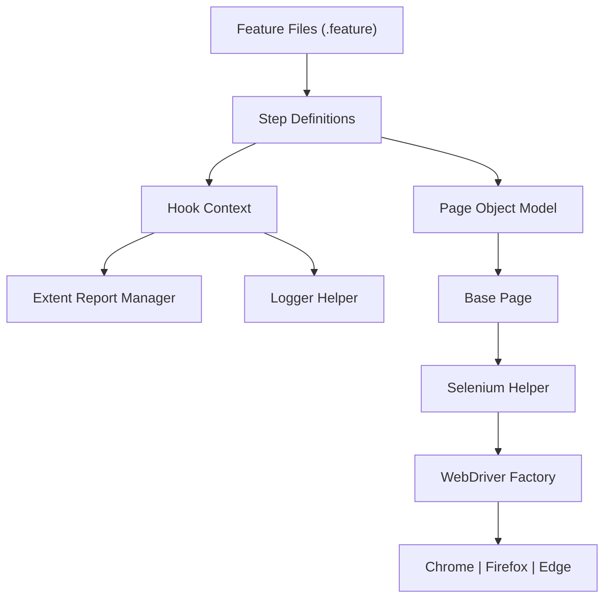
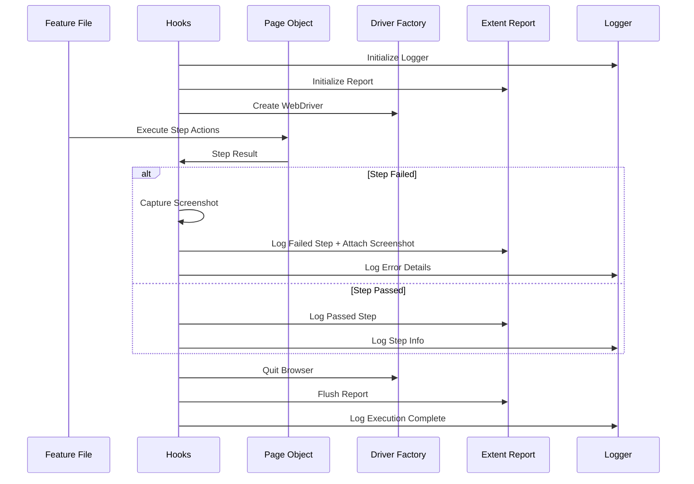
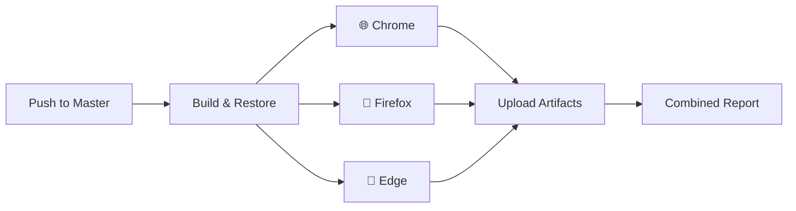
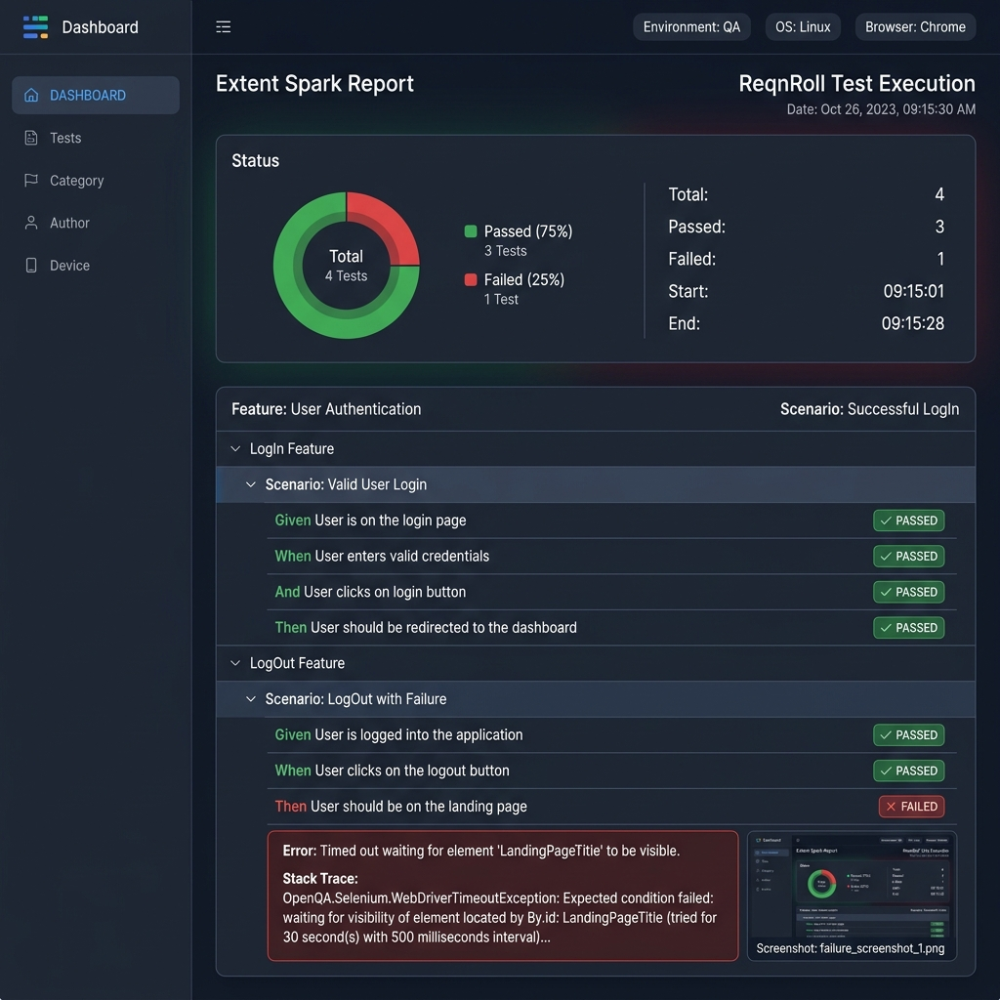

# 🚀 ReqnRoll Enterprise Automation Framework


An enterprise-grade, highly scalable, and thread-safe **Selenium BDD** framework built using **.NET 8** and **ReqnRoll** (the modern successor to SpecFlow). Includes CI/CD integration with **GitHub Actions** for cross-browser parallel execution and **Docker** support for seamless containerized testing.

---

## 📖 Table of Contents
- [🏗️ Framework Architecture](#️-framework-architecture)
- [🖼️ Framework Visualization](#️-framework-visualization)
- [🔄 CI/CD Pipeline (GitHub Actions)](#-cicd-pipeline-github-actions)
- [📊 Reporting Dashboard](#-reporting-dashboard-extent-portal)
- [🐳 Containerization (Docker)](#-containerization-docker)
- [✨ Key Features](#-key-features)
- [📂 Project Structure](#-project-structure)
- [🚀 Getting Started](#-getting-started)
- [🛠️ Tech Stack](#️-tech-stack)
- [👨‍💻 Author](#-author)

---

## 🏗️ Framework Architecture

This framework follows a strict **3-Layer Architecture** to ensure clean separation of concerns, high maintainability, and easy scalability.

### 🏛️ Design Patterns
| Pattern | Implementation |
|---|---|
| **Page Object Model (POM)** | Decouples element locators from test logic for stable UI automation. |
| **Simple Factory Pattern** | Centralized `WebDriverFactory` to manage multi-browser instances. |
| **Singleton / ThreadLocal** | Ensures thread-safe driver management for parallel execution. |
| **Dependency Injection** | Built-in `BoDi` injection for clean object lifecycles across scenarios. |

---

## 🖼️ Framework Visualization

### High-Level Architecture



### Execution Workflow



---

## 🔄 CI/CD Pipeline (GitHub Actions)

The framework includes a production-ready GitHub Actions pipeline that runs tests across **3 browsers in parallel**.

### Pipeline Architecture



---

## 📊 Reporting Dashboard (Extent Portal)

The framework generates a rich, interactive reporting portal that provide visual evidence for every execution.

### Report Preview



1. **🔍 Step-by-Step Traceability** — Full visibility into every Gherkin step executed.
2. **📸 Visual Evidence** — Automatic screenshots attached to failed steps.
3. **📈 Execution Metrics** — Dashboard views showing pass/fail percentages.
4. **🧵 Thread Isolation** — Separated reports for parallel execution.

---

## 🐳 Containerization (Docker)

Run the entire suite in isolation without local browser installations.

```bash
# Direct run via Docker Compose
docker compose up --build

# Run a specific browser inside container
docker compose run -e BROWSER=firefox automation-tests
```

---

## ✨ Key Features

- **🌐 Multi-Browser Logic** — Parallel execution on Chrome, Firefox, and Edge.
- **📊 Interactive Reports** — Extent Reports 5.x with failure screenshots.
- **📜 Platform-Agnostic Logging** — log4net configured for Windows & Linux (CI).
- **⚙️ Type-Safe Configuration** — Strongly-typed `AppConfig.json` mapping.
- **🖥️ Headless Optimization** — One-switch toggle for CI and local runs.

---

## 📂 Project Structure

```text
ReqnRollProjectArchitecture/
├── .github/workflows/       # GitHub Actions CI/CD pipeline
├── Credentials/             # Configuration & Auth management
│   ├── AppConfig.json       # Test settings & Environment data
│   └── Log4Net.config       # Cross-platform logger settings
├── Drivers/                 # WebDriver Management (Factory Pattern)
├── Features/                # ReqnRoll BDD Feature files
├── Helpers/                 # Selenium Wrapper & Utility utilities
├── Hook/                    # Lifecycle Hooks (Reporting/Screenshots)
├── Pages/                   # Page Object Model (POM) classes
├── Support/                 # Reporting, Logging & Config Models
└── TestResults/             # Generated execution artifacts
```

---

## 🚀 Getting Started

1. **Clone the repo**
2. **Configure `AppConfig.json`** (BaseUrl, Browser, etc.)
3. **Run via CLI:**
   ```bash
   dotnet test
   ```

---

## 🛠️ Tech Stack

| Component | Technology |
|---|---|
| Language | C# (.NET 8) |
| BDD Framework | ReqnRoll |
| Automation | Selenium WebDriver |
| Reporting | Extent Reports 5.x |
| Logging | log4net |
| CI/CD | GitHub Actions |

---

## 👨‍💻 Author

**Sumanta Swain**

- **Role** — AI Automation Engineer
- **Design** — Enterprise BDD Architecture
- **Contribution** — Core framework development and CI/CD strategy.

---

Happy Automation! 🤖🚀✨
