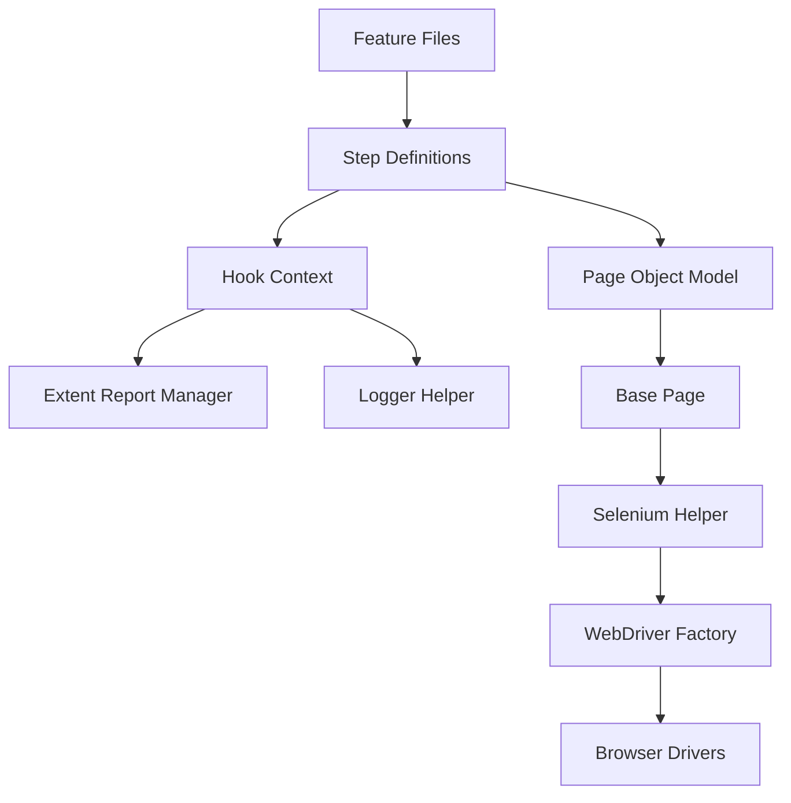
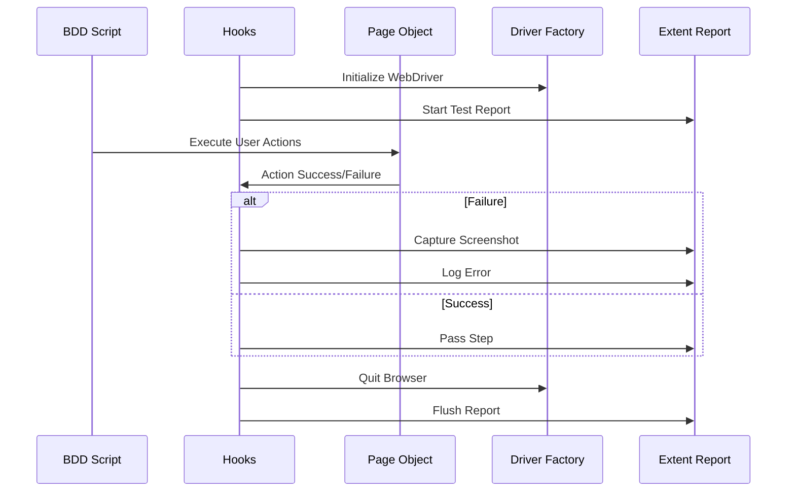

# 🚀 ReqnRoll Enterprise Automation Framework

An enterprise-grade, highly scalable, and thread-safe Selenium BDD framework built using **.NET 8** and **ReqnRoll** (the modern successor to SpecFlow).

---

## 🏗️ Framework Architecture

This framework follows a strict **3-Layer Architecture** to ensure clean separation of concerns, high maintainability, and easy scalability.

### 1. **Test Layer (BDD)**

- **Features**: Gherkin-based `.feature` files describing business behaviors.
- **Step Definitions**: C# classes that map Gherkin steps to code logic.
- **Hooks**: Global lifecycle management (Before/After scenarios, specialized reporting/logging).

### 2. **Page Object Model (POM) Layer**

- **Pages**: Encapsulates web elements and business actions for specific application pages.
- **BasePage**: Provides a shared driver instance and shared helper methods to all page objects.

### 3. **Core Support Layer**

- **Drivers**: A Factory pattern implementation for cross-browser driver management (Chrome, Firefox, Edge).
- **Helpers**: Common Selenium utilities (waits, clicks, scrolls, screenshots).
- **Credentials/Config**: Strongly-typed configuration management using `Microsoft.Extensions.Configuration`.

---

## 🖼️ Framework Visualization

### High-Level Architecture



### Execution Workflow



---

## 📊 Reporting Dashboard (Extent Portal)

The framework generates a rich, interactive reporting portal that provides:

1.  **🔍 Step-by-Step Traceability**: Full visibility into every Gherkin step executed.
2.  **📸 Visual Evidence**: Automatic high-resolution screenshots attached to failed steps.
3.  **📈 Execution Metrics**: Dashboard views showing pass/fail percentages and execution time.
4.  **🧵 Thread Isolation**: Cleanly separated reports even when running dozens of tests in parallel.

> [!TIP]
> This framework is designed to be easily integrated with **ReportPortal.io** or **Allure Reports** for centralized enterprise-level test management.

---

## ✨ Key Features

- **🌐 Cross-Browser Support**: Easily switch between Chrome, Firefox, and Edge via `AppConfig.json`.
- **📊 Extent Reports**: Beautiful, interactive HTML reports with built-in screenshot capture for failed steps.
- **📜 log4net Logging**: Detailed execution logs for deep traceability, organized by timestamp.
- **🧵 Thread-Safe Execution**: Engineered for parallel test runs using `ThreadLocal` storage for reporting and context.
- **⚙️ Strongly-Typed Configuration**: No more magic strings! Configuration is mapped directly to C# classes for type safety and IntelliSense.
- **💉 Dependency Injection**: Uses `BoDi` (built-in to ReqnRoll) for clean object management across hooks and step definitions.

---

## 📂 Project Structure

```text
ReqnRollProjectArchitecture/
├── Credentials/             # Config files (AppConfig.json, Log4Net.config)
├── Drivers/                 # WebDriver Factory and Browser implementations
├── Features/                # BDD Feature files
├── Helpers/                 # Selenium wrapper and utility methods
├── Hook/                    # ReqnRoll Hooks (Reporting & Logging setup)
├── Pages/                   # Page Object Model classes
├── StepDefinitions/         # Scenario step implementations
├── Support/                 # Reporting, Logging, and Config models
└── TestResults/             # Generated Reports, Logs, and Screenshots
```

---

## 🚀 Getting Started

### Prerequisites

- [.NET 8 SDK](https://dotnet.microsoft.com/download/dotnet/8.0)
- IDE: Visual Studio 2022 or VS Code

### Configuration

Update the `Credentials/AppConfig.json` file with your environment details:

```json
{
  "TestSettings": {
    "BaseUrl": "https://www.saucedemo.com/",
    "DefaultBrowser": "chrome",
    "ExplicitWait": 15
  }
}
```

### Running Tests

Open your terminal in the project root and run:

```bash
dotnet test
```

---

## 👨‍💻 Author

**Sumanta Swain**

- **Role**: AI Automation Engineer
- **Design**: Enterprise BDD Architecture
- **Contribution**: Framework development, reporting integration, and parallel execution logic.

---

*Happy Testing!* 🧪✨
